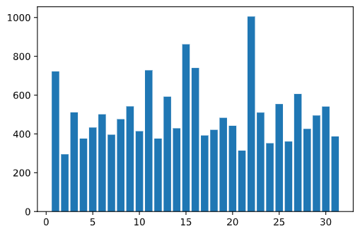
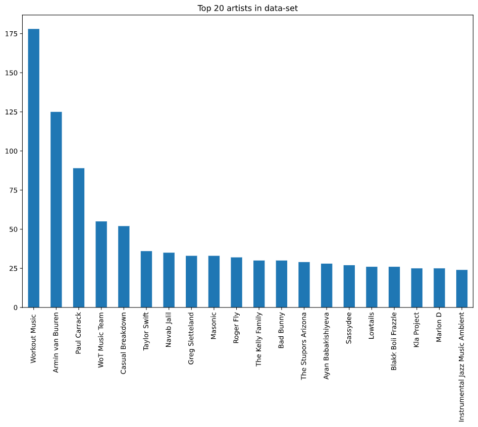

# Using a Classifier to Predict the features of a Top Song w/Python
### If you are using darkmode the figures will not show up correctly
### CSCI 347 Final Project
### Kade Pitsch & Wesley Smith

# What Does the Data look like?
Initially the data contained about 170,000 rows and 19 columns. The data starts in 1921 and goes to 2020, just under 100 years of song data which is way too much for us. We reduced our training data-set to years 2018 and 2019 which still contains 5043 rows. Our set to verify the results is just the year 2020 with 4294 rows.

Some of the columns we decided to get rid of like the associated spotify ID.
That is not important to us or the overall song popularity. Then we split the `release_date` column into `month_release`, `day_release` and `weekday_release`.
The `release_year` is also not important for our training. 
Then we plotted some simple data just to get a look at things.

The plot below is not super clear but the X-axis is days of the week 0 being Monday, 1 being Tuesday, 2 is Wednesday...etc. Friday is the most popular day of release by a long shot! There is a reason for this, the chart week starts on Friday so for artists to get the maximum time for a chart week they release on Friday at 12am. This is also data taken on our untrimmed data so it is a lot more exaggerated.


December and January are the most popular months to release. This is probably to get the highest potential at #1 album of the year. More time on the charts the better your chances i suppose. 


I don't think this graph means too much just kinda fun to look at the distribution of release days during the months. It does look like the first of the months and middle of the month have the highest values but there is no reason to release music on a certain day of the month, only important that they drop music first thing Friday.



Unfortunately we think we are going to have to drop the artists column, due to how the data is structured from Spotify's API it looks like the artist
column is also includes featured artists and there is a lot of noise going
on here. We were able to just trim this column to get the first element included in the
list but we could not find too much information on how that list was structured so it
could actually be harming our accuracy because it could be attributing it to the wrong
artist. There is so much happening in this column specifically that we
decided it is not worth it. The top 'artist' is a workout playlist that does remixes of popular songs so this pollutes our data with these kinda pseudo-duplicates because they
are unique data points but they
are also super similar to their predecessor song. We will just remove these values from
the data set. We are glad we explored this portion of the data a little more and removed it because it cleaned a lot of things up.




We started playing around with plotting certain features to see if they were highly
correlated. We got this image of the valence and the energy of the song which visually
showed some high correlation. After this we decided to actually calculate the
correlation of all the features to see if there is some data we should remove.


Digging into the data more we used some pandas magic to find the covariance matrix then
we had to unstack the Series and sort it, getting the highest values of correlation
dropping the `NaN's` from the data in the process.


After running this code we got the output of


Looking at this we can see that Energy and loudness are the most highly correlated 
features, they do get output twice for x -> y and y -> x but we can just ignore every other row in the output as they are the same measurement. Then we get energy and acousticness, loudness and acousticness and popularity and explicit.
We have to drop the popularity for the training data so explicit feature can stay. 
Energy and acousticness appear twice in our highly correlated output we will drop both of those features for our final testing. 


# Methods of Classification
To classify our data we are going to use build a our own K-Nearest Neighbors. 
The main goal is to see what gives us the most accurate result. Cross-referencing this
Then we would like to compare our accuracy against the sklearn's method and see how we hold up.
with the provided `sklearn` versions to see how good our hand-written methods do.
The thing that we want to test is what features attribute to the most popular song.
Maybe the loudness of the song is the most important maybe it is the danceability or
something else. The point of our classification is to see which of
these attributes is the most important to the popularity.
Here are the features of the data-set, artists and names were dropped for K-Nearest Neighbors
``` python
['acousticness', 'artists', 'danceability', 'duration_ms', 'energy','explicit',
        'instrumentalness', 'liveness', 'loudness', 'mode','name', 'popularity',
        'release_date', 'speechiness', 'tempo', 'valence', 'year']
```

# K-Nearest Neighbors
Just a quick overview of how the K-Nearest Neighbors works. 
We drew up a quick sketch attached below to help visualize what is happening.
The star in the center is our initial data point. And we want to find the class that 
it is associated with. We kinda made our self a tricky example because there are equal class objects
See the circle around the initial data point is just a visualizer as the real 'circle' is just a distance
measurement from the initial point. The easiest way to break this tie is that we could reduce the the
distance at which we consider K and whichever point gets 'cut' out first is not going to be a part of our class
so if that circle was centered correctly and we reduce that threshold of K then the first point that
we would lose is that pink circle in the top left of the bigger circle. 
Then we set our initial point to the new class of blue triangles because they are the 'dominant' class 
of the circle.
This is just a kinda pseudo-codeish overview of what we are doing in the algorithm


We chose this method after logistic regression just ended up being too much to bite off
After several attempts at it we gave it up to focus more on the project rather than a
special algorithm. 
So we built our own version of K-Nearest neighbors that performs pretty well...sometimes.

We ran our KNN algorithm on the data set with all the features and compare the accuracy 
between our coded method to the built in method on the bottom. We are running the algorithm
on the a random sample so every run is pretty variable. This time the scores are pretty
close. I would of liked to built in a method to visualize the data from our built method
but we just did not have enough time to do that. So we will have to explore that data more
through sklearn's library of KNN


Here is the accuracy score after dropping the features that were "highly" correlated we tried
running this a few times to see if the random data was messy with the out come but
after about three runs it seems like removing those features made the accuracy way worse
for our method. We do not really understand why this is happening besides that the sklearn 
library must do a lot more fancy stuff that we are not accounting for.


Another output from running the code with dropped features and this time our method 
'technically' performed better than the sklearn's version. We suspect that this data-set is 
just to hectic for our classification.


# Conclusions
After testing our data and trying different input to the algorithm we decided that our data is not a good data
set for what we were planning on doing with it. We wanted to see which song features included in the spotify API
dataset. Now these are just our initial understanding of the problems we faced. This was our first big
jump into the classifiers world and we may of missed a few things along the way. 
From the research that we did we knew that Naive-bayes would not do that good on this data-set because Naive-bays
works better on categorical data which this set did not have a lot of. Our initial problem may have been the
wrong question to ask too. Looking back now it seems like an ambitious question to ask and get the result we assumed we would. The reality of it that there are so many external factors to what makes a hit song a hit song.
This can include who and when the song is being dropped. Although we did see that most songs do get released
on Friday and most commonly in December and January but unfortunately that speak nothing to the 'hotness' of the 
song. We have seen in these recent few years that a song can go from 0 plays from an artist you have never
heard about to a million streams in one week thanks to the virality of social-media platforms like Tik-Tok.
All this considered and Spotify's popularity score is not objective to the overall popularity of the song. 
We can see this by looking at the top songs from huge artist's like Drake and Kanye West. We can see that
there 'top songs' do not align across platforms. 

### Here is Kanye and Drakes Top 5 on Spotify


### Top 5 on YouTube Music


So just here we can see the 'weirdness' of popularity scoring on the different platforms. Both artists only
share 1 top 5 song across platforms. Another quirk of the data is that it is not being based solely on amount
of plays that each artist receives. We can see in Kanye's top 5 "Heartless" has almost 150,000 more streams than
"Bound 2" so while we may of been able to classify a 'popular' song with this data-set it would only be a popular
song on Spotify.

# Changes
I think if we were to recreate this sort of test we would try making a better and more clean data-set. One which
could make predictions about what spotify song feature appears the most in the number 1 songs and maybe there 
is a hybrid of the spotify data and the top billboard 100 data. Then we have concrete data to build it on. We 
could end up being a formula for what you need to get you there. Although i believe that is fairly unrealistic
and a cookie cutter formula would take away all the fun in music. Overall we both believe that having a better
understanding of classifiers.
and what ones will work the best with the data that we provide and also just a general understanding 
of how they work. These two factors would have greatly increase our outcome but we wanted something that was
unfamiliar and challenging. We both think we succeeded there!
